<div align="center">

<!-- ██████████████████████ HERO BANNER ██████████████████████ -->


<br/><br/>

<!-- SOCIAL BADGES -->
[](https://www.linkedin.com/in/aryan-bhat-424199328)
[](https://www.instagram.com/aaryaaawn)
[](mailto:aryanb3435@gmail.com)
[](https://github.com/ARYANBHAT-eng)

</div>

<br/>


## 👾 About Me

```python
engineer = {
    "name"      : "Aryan Bhat",
    "role"      : "Full Stack Product Engineer",
    "education" : "B.Tech IT Graduate - Batch 2025",
    "location"  : "Jammu, India",
    "mission"   : "Building intelligent backends, automation systems & scalable SaaS infrastructure.",
    "interests" : [
                    "Backend Architecture",  "Workflow Automation",
                    "AI Systems",            "SaaS Infrastructure",
                    "Analytics Engineering", "Operational Platforms"
                  ]
}
```


## 🛠️ Tech Stack

**⚡ Languages**


**🔧 Backend Engineering**


**🎨 Frontend Development**


**🗄️ Databases**


**🤖 AI / ML & Analytics**


**⚙️ DevOps & Deployment**


## 💼 Experience

| Period | Role | Company | Focus Area |
|:---|:---|:---|:---|
| `Mar 2026 – Present` | Founding Frontend Developer | **Jammu Book Club** | React Frontend · UI Systems · Product Engineering |
| `Aug 2025 – Jan 2026` | Full Stack / SDE Intern | **BitePay India** | Backend APIs · Auth Systems · Scalable Architecture |
| `Jan 2025 – Apr 2025` | Project Intern | **HT Digital Streams** | Analytics Dashboards · KPI Systems · Data Pipelines |
| `May 2021 – Jun 2021` | Engagement & Analytics Intern | **Metvy** | User Analytics · Behavioral Insights · Operations |


## 🎯 Current Focus

```bash
$ aryan --status

  [■■■■■■■■░░]  AI-integrated operational systems
  [■■■■■■░░░░]  Workflow automation platforms
  [■■■■■■■■░░]  Backend architecture with FastAPI
  [■■■■■░░░░░]  Analytics-driven SaaS applications
  [■■■■■■■░░░]  Scalable full stack infrastructure

> STATUS: Building in production. Always.
```


## 📊 GitHub Stats

<div align="center">


</div>

<br/>


